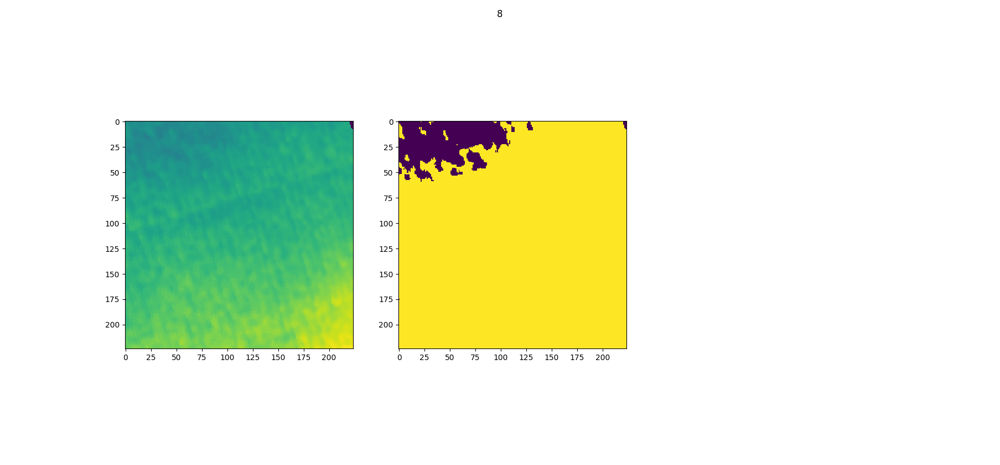

# "Good Robot!" Efficient Reinforcement Learning for Multi-Step Visual Tasks via Reward Shaping

[Andrew Hundt](http://ahundt.github.io/), Benjamin Killeen, Heeyeon Kwon, Chris Paxton, and Gregory D. Hager

Click the image to watch the video:

[](https://youtu.be/MbCuEZadkIw)

## Paper, Abstract, and Citations

[Good Robot! Paper on IEEE Xplore](http://doi.org/10.1109/LRA.2020.3015448), 
[Good Robot! Paper on ArXiV](https://arxiv.org/abs/1909.11730)

```
@article{hundt2020good,
	title="“Good Robot!”: Efficient Reinforcement Learning for Multi-Step Visual Tasks with Sim to Real Transfer",
	author="Andrew {Hundt} and Benjamin {Killeen} and Nicholas {Greene} and Hongtao {Wu} and Heeyeon {Kwon} and Chris {Paxton} and Gregory D. {Hager}",
	journal="IEEE Robotics and Automation Letters (RA-L)",
	volume="5",
	number="4",
	pages="6724--6731",
	year="2020",
	url={https://arxiv.org/abs/1909.11730}
}
```

Abstract— Current Reinforcement Learning (RL) algorithms struggle with long-horizon tasks where time can be wasted exploring dead ends and task progress may be easily reversed. We develop the SPOT framework, which explores within action safety zones, learns about unsafe regions without exploring them, and prioritizes experiences that reverse earlier progress to learn with remarkable efficiency.

The SPOT framework successfully completes simulated trials of a variety of tasks, improving a baseline trial success rate from 13% to 100% when stacking 4 cubes, from 13% to 99% when creating rows of 4 cubes, and from 84% to 95% when clearing toys arranged in adversarial patterns. Efficiency with respect to actions per trial typically improves by 30% or more, while training takes just 1-20k actions, depending on the task.

Furthermore, we demonstrate direct sim to real transfer. We are able to create real stacks in 100% of trials with 61% efficiency and real rows in 100% of trials with 59% efficiency by directly loading the simulation-trained model on the real robot with no additional real-world fine-tuning. To our knowledge, this is the first instance of reinforcement learning with successful sim to real transfer applied to long term multi-step tasks such as block-stacking and row-making with consideration of progress reversal. Code is available at https://github.com/jhu-lcsr/good_robot.

## Training Row Making, Stack Making, and Table Clearing Tasks

Details of our specific training and test runs, command line commands, pre-trained models, and logged data with images are on the [good_robot github releases page](https://github.com/jhu-lcsr/good_robot/releases).

### Starting the V-REP Simulation

[Download CoppeliaSim](http://www.coppeliarobotics.com/index.html) (formerly V-REP) and run it to start the simulation. Uou may need to adjust the paths below to match your V-REP folder, and it should be run from the costar_visual_stacking repository directory:

```bash
cd ~/src/real_good_robot
~/src/CoppeliaSim_Edu_V4_0_0_Ubuntu18_04/coppeliaSim.sh -gREMOTEAPISERVERSERVICE_19997_FALSE_TRUE -s ~/src/real_good_robot/simulation/simulation.ttt
```

### Cube Stacking


#### Cube Stack Training

```bash
export CUDA_VISIBLE_DEVICES="0" && python3 main.py --is_sim --obj_mesh_dir objects/blocks --num_obj 4 --push_rewards --experience_replay --explore_rate_decay --check_row --tcp_port 19997 --place --future_reward_discount 0.65 --max_train_actions 20000 --random_actions --common_sense --trial_reward
```

All training results will go in the `path/to/good_robot/logs/<training_run>` folder.
To use SPOT Progress Reward remove `--trial_reward` from this command.
To disable the "common sense" dynamic action space regions remove `--common_sense` from this command.
This command will automatically run in test mode once training is complete, and the testing results directory will be moved into the training results directory.

#### Manual Cube Stack Testing

Remember to first train the model or download the snapshot file from the release page (ex: [v0.12 release](https://github.com/jhu-lcsr/costar_visual_stacking/releases/tag/v0.12.0)) and update the command line `--snapshot_file FILEPATH`:

```bash
export CUDA_VISIBLE_DEVICES="0" && python3 main.py --is_sim --obj_mesh_dir 'objects/blocks' --num_obj 4  --push_rewards --experience_replay --explore_rate_decay --place --load_snapshot --snapshot_file ~/Downloads/snapshot.reinforcement-best-stack-rate.pth --random_seed 1238 --is_testing --save_visualizations --disable_situation_removal
```

#### Sim to Real Stack Testing

You will need a fully configured real robot, we have some instructions in this readme.
You will also need to update the snapshot file path to wherever your version is:

```bash
export CUDA_VISIBLE_DEVICES="0" && python3 main.py --num_obj 8  --push_rewards --experience_replay --explore_rate_decay --trial_reward --common_sense --check_z_height --place --future_reward_discount 0.65 --is_testing --random_seed 1238 --max_test_trials 10 --save_visualizations --random_actions --snapshot_file /media/costar/f5f1f858-3666-4832-beea-b743127f1030/real_good_robot/logs/2020-05-13-12-51-39_Sim-Stack-SPOT-Trial-Reward-Masked-Training/models/snapshot.reinforcement_action_efficiency_best_value.pth
```

### Row of 4 Cubes


Row Testing Video:

[](https://youtu.be/Ti3mSGvbc7w)

[Row v0.12 release page and pretrained models](https://github.com/jhu-lcsr/costar_visual_stacking/releases/tag/v0.12.0).

#### Row Training

```bash
CUDA_VISIBLE_DEVICES="0" && python3 main.py --is_sim --obj_mesh_dir objects/blocks --num_obj 4 --push_rewards --experience_replay --explore_rate_decay --check_row --tcp_port 19997 --place --future_reward_discount 0.65 --max_train_actions 20000 --random_actions --common_sense
```

Testing will automatically run after training is complete.

#### Manual Row Testing

```bash
export CUDA_VISIBLE_DEVICES="0" && python3 main.py --is_sim --obj_mesh_dir 'objects/blocks' --num_obj 4  --push_rewards --experience_replay --explore_rate_decay --trial_reward --future_reward_discount 0.65 --place --check_row --is_testing  --tcp_port 19996 --load_snapshot --snapshot_file '/home/costar/Downloads/snapshot-backup.reinforcement-best-stack-rate.pth' --random_seed 1238 --disable_situation_removal --save_visualizations
```

#### Sim to Real Row Testing

You will need a fully configured real robot, we have some instructions in this readme.
You will also need to update the snapshot file path to wherever your version is:

```bash
export CUDA_VISIBLE_DEVICES="0" && python3 main.py --num_obj 4 --push_rewards --experience_replay --explore_rate_decay --check_row --check_z_height --place --future_reward_discount 0.65  --is_testing --random_seed 1238 --max_test_trials 10 --random_actions --save_visualizations --common_sense --snapshot_file "/home/costar/src/real_good_robot/logs/2020-06-03-12-05-28_Sim-Rows-Two-Step-Reward-Masked-Training/models/snapshot.reinforcement_trial_success_rate_best_value.pth"
```

### Push + Grasp

We provide backwards compatibility with the [Visual Pushing Grasping (VPG) GitHub Repository](https://github.com/andyzeng/visual-pushing-grasping), and evaluate on their pushing and grasping task as a baseline from which to compare our algorithms.

#### Push + Grasp Training

```bash
export CUDA_VISIBLE_DEVICES="0" && python3 main.py --is_sim --obj_mesh_dir 'objects/toys' --num_obj 10  --push_rewards --experience_replay --explore_rate_decay
```

You can also run without `--trial_reward` and with the default `--future_reward_discount 0.5`.

#### Push + Grasp Random Object Location Testing


```bash
 export CUDA_VISIBLE_DEVICES="0" && python3 main.py --is_sim --obj_mesh_dir 'objects/toys' --num_obj 10  --push_rewards --experience_replay --explore_rate_decay --load_snapshot --snapshot_file '/home/costar/src/costar_visual_stacking/logs/2019-08-17.20:54:32-train-grasp-place-split-efficientnet-21k-acc-0.80/models/snapshot.reinforcement.pth' --random_seed 1238 --is_testing --save_visualizations
```

#### Push + Grasp Adversarial Object Location Testing


[Adversarial pushing and grasping release v0.3.2](https://github.com/jhu-lcsr/costar_visual_stacking/releases/tag/push_grasp_v0.3.2) video:

[](https://youtu.be/F85d9xGCDnY)

```bash
export CUDA_VISIBLE_DEVICES="0" && python3 main.py --is_sim --obj_mesh_dir 'objects/toys' --num_obj 10  --push_rewards --experience_replay --explore_rate_decay --trial_reward --future_reward_discount 0.65 --tcp_port 19996 --is_testing --random_seed 1238 --load_snapshot --snapshot_file '/home/ahundt/src/costar_visual_stacking/logs/2019-09-12.18:21:37-push-grasp-16k-trial-reward/models/snapshot.reinforcement.pth' --max_test_trials 10 --test_preset_cases
```

After Running the test you need to summarize the results:

```bash
python3 evaluate.py --session_directory /home/ahundt/src/costar_visual_stacking/logs/2019-09-16.02:11:25  --method reinforcement --num_obj_complete 6 --preset
```

### Troubleshooting

During training, be sure to check the simulator doesn't encounter physics bugs, such as blocks permanently bonded to the gripper.
If this happens, you will notice one action will never succeed, and the other might always succeed, and multi-step tasks will no longer progress.
If you catch it quickly, you can directly remove the object in the simulator with the scene editing tools, or simply stop the simulation and the training function should detect the problem and reset.

## Data Collection and Data Release Checklist (v0.1, checklist creation is in progress)

This is a checklist for all the steps you should follow to collect data consistently.

1. Save the following data about the run you are going to do into a txt file for your records:
        1. Describe the configuration you are running
        2. Git commit hash of the code version you will run
        2. Exact command line command you will run
        3. Current CoppeliaSim (aka V-REP) ip address port (if simulation mode)
        4. GPU number you will use on the computer
2. Start recording: If sim, start V-REP & Start V-REP Recording. If running the real robot, start a real camera recording the robot.
3. Start the run.
4. After the run completes:
    1. Do a random testing run for a reasonable number of trials like 10-100.
    2. If pushing and grasping do an adversarial scenario testing run.
    3. Make note of the directories with results, and include dir path in your txt file.
5. Create a github release.
    1. Add the model file binary to the release binaries so it is easier to download and utilize.
    2. Incorporate the log folder name in the release name.
    3. Provide a good description in english of what the run was trying to achieve.
    4. Find several representative images, and add them directly to the release page for easy viewing.
    5. Zip visualization directory separately because they tend to be larger files & upload to the github release.
    6. Move the visualization directory out and then zip the remainder of the log directory and upload to the github release.
    7. Zip up the random testing directories and adversarial testing directories (if applicable) upload to the github release binaries.
    8. Upload the video recording to a website such as youtube, and add a link to the github release.
    9. Make sure the github release commit lines up with the commit you actually ran your experiment on.
    10. Submit the github release.

## Costar Visual Stacking Execution Details

### Running Multiple Simulations in Parallel

It is possible to do multiple runs on different GPUs on the same machine. First, start an instance of V-Rep as below,

```bash
~/src/V-REP_PRO_EDU_V3_6_2_Ubuntu16_04/vrep.sh -gREMOTEAPISERVERSERVICE_19997_FALSE_TRUE -s simulation/simulation.ttt
```

being careful to use V-Rep 3.6.2 wherever it is installed locally. The port number, here 19997 which is the usual default, is the important point, as we will cahnge it in subsequent runs.

Start the simulation as usual, but now specify `--tcp_port 19997`.

Start another V-Rep session.

```bash
~/src/V-REP_PRO_EDU_V3_6_2_Ubuntu16_04/vrep.sh -gREMOTEAPISERVERSERVICE_19996_FALSE_TRUE -s simulation/simulation.ttt
```

For some reason, the port number is important here, and should be selected to be lower than already running sessions.

When you start training, be sure to specify a different GPU. For example, if previously you set

```bash
export CUDA_VISIBLE_DEVICES="0"
```

then you should likely set

```bash
export CUDA_VISIBLE_DEVICES="1"
```

and specify the corresponding tcp port `--tcp_port 19996`.

Additional runs in parallel should use ports 19995, 19994, etc.

## Generating plots

To generate plots run `python3 plot.py`, you can manually edit the bottom part of `plot.py` to call `plot_it()` for your folder.

```python
    log_dir = './logs/2020-02-03-16-57-28_Sim-Stack-Trial-Reward-Common-Sense-Training'
    plot_it(log_dir,'Sim Stack, SPOT Reward, Common Sense, Training', window=window, max_iter=None)
```

The configuration of the plot should be done automatically from the folder.

## Running on a Real UR5 with ROS Based Image Collection

### ROS Based Image Collection Setup

We require python3, so you'll need to ensure `export ROS_PYTHON_VERSION=3` is set for the build. A couple additional steps below will need to be added in the middle. We advise installing in the folder:

```
~/ros_catkin_ws
```

Follow instructions in the [ROS Melodic steps to build ros from source](http://wiki.ros.org/melodic/Installation/Source).

In particular fix up this command:

```
export ROS_PYTHON_VERSION=3 && rosinstall_generator desktop_full --rosdistro melodic --deps --tar > melodic-desktop-full.rosinstall && wstool init -j8 src melodic-desktop-full.rosinstall
```

For the primesense camera add in the [openni2_launch](https://github.com/ros-drivers/openni2_launch), and [rgbd_launch](https://github.com/ros-drivers/rgbd_launch) repositories, and for handeye calibration between the camera and robot add [UbiquityRobotics/fiducials](https://github.com/UbiquityRobotics):

```
cd ~/catkin_ros_ws
git clone https://github.com/ros-drivers/openni2_launch.git
git clone https://github.com/ros-drivers/rgbd_launch.git
git clone https://github.com/UbiquityRobotics/fiducials.git
```

Run the build and install.

```
cd ~/ros_catkin_ws
rosdep install --from-paths src --ignore-src --rosdistro melodic -y && ./src/catkin/bin/catkin_make_isolated --install
```
<!--
Then install the primesense image pipeline:

```bash
sudo apt-get install ros-melodic-openni2-launch ros-melodic-image-pipeline python3-rospkg python3-catkin-pkg
``` -->

Source the ros setup so you get access to the launch commands:
```
source ~/ros_catkin_ws/install_isolated/setup.zsh
```

Running ROS with depth image processing:

```bash
taskset 0x00000FFF roslaunch openni2_launch openni2.launch depth_registration:=true
```

We use the [linux taskset command](https://linux.die.net/man/1/taskset) ([examples](https://www.howtoforge.com/linux-taskset-command/)) to limit ROS to utilizing 8 cores or fewer, so other cores are available for training.

In a separate tab run our small test script:

```bash
python test_ros_images.py
```

Running RVIZ to look at the images:

```
rosrun rviz rviz
```

The correct images, as done in the [JHU costar dataset](https://sites.google.com/site/costardataset) class [collector](https://github.com/jhu-lcsr/costar_plan/blob/d469d62d72cd405ed07b10c62eb24391c0af1975/ctp_integration/python/ctp_integration/collector.py), are from the following ROS topics:

```

        self.rgb_topic = "/camera/rgb/image_rect_color"
        # raw means it is in the format provided by the openi drivers, 16 bit int
        self.depth_topic = "/camera/depth_registered/hw_registered/image_rect"
```

#### Calibrating Camera Intrincics

You must first calibrate your rgb and depth camera intrinsics and rectify your images to ensure you can accurately convert camera positions to robot poses. We do this using [camera_calibration](http://wiki.ros.org/camera_calibration) in the [ros-perception/image_pipeline](https://github.com/ros-perception/image_pipeline) library.

You will need to generate and load a calibration yaml file which goes in a location like `~/.ros/camera_info/rgb_PS1080_PrimeSense.yaml`. We have an examle from our robot in this repository saved at [real/rgb_PS1080_PrimeSense.yaml](real/rgb_PS1080_PrimeSense.yaml).

#### Calibrating Camera Extrinsics

1. Print an [ArUco Tag](http://chev.me/arucogen/), we use 70mm tags with the 4x4 design (dictionary 1), so it can fit in the gripper. Make sure the ArUco dictionary id in the launch files is correct. Attach the ArUco Tag on the robot.

2. Edit the fiducials ROS package [aruco_detect.launch](https://github.com/UbiquityRobotics/fiducials/blob/kinetic-devel/aruco_detect/launch/aruco_detect.launch) file in `~/ros_catkin_ws/src/fiducials/aruco_detect/launch/aruco_detect.launch` from the [fiducials github repository](https://github.com/UbiquityRobotics/fiducials) you cloned earlier, see [the fiducials wiki for reference](http://wiki.ros.org/fiducials). Modify the launch file in [fiducials/aruco to detect your markers and receive images from your sensor. Here is our configuration:

```

<!-- Run the aruco_detect node -->
<launch>
  <!-- namespace for camera input -->
  <!-- /camera/rgb/image_rect_color/compressed -->
  <arg name="camera" default="/camera/rgb"/>
  <arg name="image" default="image_rect_color"/>
  <arg name="transport" default="compressed"/>
  <arg name="fiducial_len" default="0.07"/>
  <arg name="dictionary" default="1"/>
  <arg name="do_pose_estimation" default="true"/>
  <arg name="ignore_fiducials" default="" />
  <arg name="fiducial_len_override" default="" />

  <node pkg="aruco_detect" name="aruco_detect"
    type="aruco_detect" output="screen" respawn="false">
    <param name="image_transport" value="$(arg transport)"/>
    <param name="publish_images" value="true" />
    <param name="fiducial_len" value="$(arg fiducial_len)"/>
    <param name="dictionary" value="$(arg dictionary)"/>
    <param name="do_pose_estimation" value="$(arg do_pose_estimation)"/>
    <param name="ignore_fiducials" value="$(arg ignore_fiducials)"/>
    <param name="fiducial_len_override" value="$(arg fiducial_len_override)"/>
    <remap from="/camera/compressed"
        to="$(arg camera)/$(arg image)/$(arg transport)"/>
    <remap from="/camera_info" to="$(arg camera)/camera_info"/>
  </node>
</launch>
```

5. You must predefine the `workspace_limits` python variables in the `calibration_ros.py`, `touch.py`, and `main.py`, and `robot.py`. To modify these locations, change the variables `workspace_limits` at the end of `calibrate_ros.py`. You may define it in the `Calibrate` class or in the function `collect_data` for data collection.

3. The code directly communicates with the robot via TCP. At the top of `calibrate_ros.py`, change variable `tcp_host_ip` to point to the network IP address of your UR5 robot controller.

4. Roslaunch the camera with, for example:
```shell
taskset 0x00000FFF roslaunch openni2_launch openni2.launch depth_registration:=true

We use the [linux taskset command](https://linux.die.net/man/1/taskset) ([examples](https://www.howtoforge.com/linux-taskset-command/)) to limit ROS to utilizing 8 cores or fewer, so other cores are available for training.

```

5. The script is subscribed to the rostopic `/fiducial_transform` to get the pose of the tag in the camera frame. Roslaunch aruco_detect:
```shell
taskset 0x00000FFF roslaunch aruco_detect aruco_detect.launch
```

The robot will move suddenly and rapidly. Users **must** be ready to push the **emergency stop** button at any time.

6. CAREFULLY run `python touch.py` to start the arm, it will move suddenly!

7. Center the AR tag on the gripper manually using the teach mode button on the robot.

8. Click on the title bar of the `color` image window, do not click on the general color area the robot may move suddenly!

8. Press `-` to close the gripper (`=` will open it), and check that the center of the AR tag is where you want your gripper center to be defined.

9. Press `k` to calibrate, and after going to a number of positions you should see a calibration result like the following:

```
Total number of poses: 26
Invalid poses number: 0
Robot Base to Camera:
[[ 0.1506513   0.87990966 -0.45062533  0.79319678]
 [ 0.98857761 -0.13210593  0.07254191 -0.14601768]
 [ 0.00430005 -0.45640664 -0.88976092  0.55173518]
 [ 0.          0.          0.          1.        ]]
Total number of poses: 26
Invalid poses number: 0
Tool Tip to AR Tag:
[[ 0.18341198 -0.01617267 -0.98290309  0.0050482 ]
 [ 0.03295954  0.99940367 -0.01029385  0.01899328]
 [ 0.98248344 -0.03050802  0.18383565  0.10822485]
 [ 0.          0.          0.          1.        ]]
```

Backup procedure (in place of the steps 6 and later from above):
with caution, run the following to move the robot and calibrate:

The robot will move suddenly and rapidly. Users **must** be ready to push the **emergency stop** button at any time.

```shell
python calibrate_ros.py
```

The script will record the pose of the robot and the ArUco tag in the camera frame with correspondence. Then it uses the [Park and Martin Method](https://ieeexplore.ieee.org/stamp/stamp.jsp?arnumber=326576) to solve the AX=XB problem for the hand-eye calibration. And the method is implemented in the `utils.py`. The script will generate a `robot_base_to_camera_pose.txt` in `real/`. This txt basically is the pose of the camera in the robot base frame.

If you already have corresponded pose file of the robot and the ArUco tag, you can also use the `calibrate()` function in the `calibrate_ros.py` to directly calculate the pose of the camera without the data collection step.

### Collecting the Background heightmap

The real robot also uses a background heightmap of the scene with no objects present.

1. Completely clear the table or working surface.
2. Back up and remove the current `real/background_heightmap.depth.png`.
3. Run pushing and grasping data collection with the `--show_heightmap` flag.
4. View the heightmap images until you see one with no holes (black spots), and save the iteration number at the top.
5. Copy the good heightmap from `logs/<run_folder>/data/depth_heightmaps/<iteration>.0.depth.png` and rename it to `real/background_heightmap.depth.png`.
6. Stop and re-run pushing and grasping with the `--show_heightmap` flag.

Here is an example of the matplotlib visualization of a good depth heightmap, there are no black specks aside from one corner which is out of the camera's field of view:



Your updated depth heightmaps should be good to go!


## "Good Robot!" is forked from the Visual Pushing and Grasping Toolbox

[Original Visual Pushing Grasping (VPG) Repository](https://github.com/andyzeng/visual-pushing-grasping). Edits have been made to the text below to reflect some configuration and code updates needed to reproduce the previous VPG paper's original behavior:

Visual Pushing and Grasping (VPG) is a method for training robotic agents to learn how to plan complementary pushing and grasping actions for manipulation (*e.g.* for unstructured pick-and-place applications). VPG operates directly on visual observations (RGB-D images), learns from trial and error, trains quickly, and generalizes to new objects and scenarios.


&nbsp;&nbsp;&nbsp;&nbsp;&nbsp;&nbsp;&nbsp;&nbsp;&nbsp;&nbsp;<br>

This repository provides PyTorch code for training and testing VPG policies with deep reinforcement learning in both simulation and real-world settings on a UR5 robot arm. This is the reference implementation for the paper:

### Learning Synergies between Pushing and Grasping with Self-supervised Deep Reinforcement Learning

[PDF](https://arxiv.org/pdf/1803.09956.pdf) | [Webpage & Video Results](http://vpg.cs.princeton.edu/)

[Andy Zeng](http://andyzeng.github.io/), [Shuran Song](http://vision.princeton.edu/people/shurans/), [Stefan Welker](https://www.linkedin.com/in/stefan-welker), [Johnny Lee](http://johnnylee.net/), [Alberto Rodriguez](http://meche.mit.edu/people/faculty/ALBERTOR@MIT.EDU), [Thomas Funkhouser](https://www.cs.princeton.edu/~funk/)

IEEE/RSJ International Conference on Intelligent Robots and Systems (IROS) 2018

Skilled robotic manipulation benefits from complex synergies between non-prehensile (*e.g.* pushing) and prehensile (*e.g.* grasping) actions: pushing can help rearrange cluttered objects to make space for arms and fingers; likewise, grasping can help displace objects to make pushing movements more precise and collision-free. In this work, we demonstrate that it is possible to discover and learn these synergies from scratch through model-free deep reinforcement learning. Our method involves training two fully convolutional networks that map from visual observations to actions: one infers the utility of pushes for a dense pixel-wise sampling of end effector orientations and locations, while the other does the same for grasping. Both networks are trained jointly in a Q-learning framework and are entirely self-supervised by trial and error, where rewards are provided from successful grasps. In this way, our policy learns pushing motions that enable future grasps, while learning grasps that can leverage past pushes. During picking experiments in both simulation and real-world scenarios, we find that our system quickly learns complex behaviors amid challenging cases of clutter, and achieves better grasping success rates and picking efficiencies than baseline alternatives after only a few hours of training. We further demonstrate that our method is capable of generalizing to novel objects.

<!--  -->


#### Citing

If you find this code useful in your work, please consider citing:

```
@inproceedings{zeng2018learning,
  title={Learning Synergies between Pushing and Grasping with Self-supervised Deep Reinforcement Learning},
  author={Zeng, Andy and Song, Shuran and Welker, Stefan and Lee, Johnny and Rodriguez, Alberto and Funkhouser, Thomas},
  booktitle={IEEE/RSJ International Conference on Intelligent Robots and Systems (IROS)},
  year={2018}
}
```

#### Demo Videos

Demo videos of a real robot in action can be found [here](http://vpg.cs.princeton.edu/).

#### Contact

The contact for CoSTAR Visual Stacking is [Andrew Hundt](http://ahundt.github.io/).
The contact for the original [Visual Pushing Grasping repository](https://github.com/andyzeng/visual-pushing-grasping) is [Andy Zeng](http://www.cs.princeton.edu/~andyz/) andyz[at]princeton[dot]edu

## Installation

This implementation requires the following dependencies (tested on Ubuntu 16.04.4 LTS):

* Python 2.7 or Python 3
* [NumPy](http://www.numpy.org/), [SciPy](https://www.scipy.org/scipylib/index.html), [OpenCV-Python](https://docs.opencv.org/3.0-beta/doc/py_tutorials/py_tutorials.html), [Matplotlib](https://matplotlib.org/). You can quickly install/update these dependencies by running the following (replace `pip` with `pip3` for Python 3):

  ```bash
  pip3 install numpy scipy opencv-python matplotlib
  ```

* [PyTorch](http://pytorch.org/) version 1.2:

  ```bash
  pip3 install torch==1.2 torchvision==0.4.0
  ```

* [V-REP](http://www.coppeliarobotics.com/) (simulation environment)

### (Optional) GPU Acceleration
Accelerating training/inference with an NVIDIA GPU requires installing [CUDA](https://developer.nvidia.com/cuda-downloads) and [cuDNN](https://developer.nvidia.com/cudnn). You may need to register with NVIDIA for the CUDA Developer Program (it's free) before downloading. This code has been tested with CUDA 8.0 and cuDNN 6.0 on a single NVIDIA Titan X (12GB). Running out-of-the-box with our pre-trained models using GPU acceleration requires 8GB of GPU memory. Running with GPU acceleration is **highly recommended**, otherwise each training iteration will take several minutes to run (as opposed to several seconds). This code automatically detects the GPU(s) on your system and tries to use it. If you have a GPU, but would instead like to run in CPU mode, add the tag `--cpu` when running `main.py` below.

## A Quick-Start: Demo in Simulation


This demo runs our pre-trained model with a UR5 robot arm in simulation on challenging picking scenarios with adversarial clutter, where grasping an object is generally not feasible without first pushing to break up tight clusters of objects.

### Instructions

1. Checkout this repository and download our pre-trained models.

    ```shell
    git clone https://github.com/jhu-lcsr/costar_visual_stacking.git visual-pushing-grasping
    cd visual-pushing-grasping/downloads
    ./download-weights.sh
    cd ..
    ```

1. Run V-REP (navigate to your V-REP directory and run `./vrep.sh`). From the main menu, select `File` > `Open scene...`, and open the file `visual-pushing-grasping/simulation/simulation.ttt` from this repository.

1. In another terminal window, run the following (simulation will start in the V-REP window):

    ```shell
    python main.py --is_sim --obj_mesh_dir 'objects/blocks' --num_obj 10 \
        --push_rewards --experience_replay --explore_rate_decay \
        --is_testing --test_preset_cases --test_preset_file 'simulation/test-cases/test-10-obj-07.txt' \
        --load_snapshot --snapshot_file 'downloads/vpg-original-sim-pretrained-10-obj.pth' \
        --save_visualizations --nn densenet
    ```

Note: you may get a popup window titled "Dynamics content" in your V-REP window. Select the checkbox and press OK. You will have to do this a total of 3 times before it stops annoying you.

## Training

To train a regular VPG policy from scratch in simulation, first start the simulation environment by running V-REP (navigate to your V-REP directory and run `./vrep.sh`). From the main menu, select `File` > `Open scene...`, and open the file `visual-pushing-grasping/simulation/simulation.ttt`. Then navigate to this repository in another terminal window and run the following:

```shell
python main.py --is_sim --push_rewards --experience_replay --explore_rate_decay --save_visualizations
```

Data collected from each training session (including RGB-D images, camera parameters, heightmaps, actions, rewards, model snapshots, visualizations, etc.) is saved into a directory in the `logs` folder. A training session can be resumed by adding the `--resume` flag, which then loads the model snapshot specified by `--snapshot_file` and transition history from the provided session directory:

```shell
python main.py --is_sim --push_rewards --experience_replay --explore_rate_decay --save_visualizations \
    --snapshot_file 'logs/YOUR-SESSION-DIRECTORY-NAME-HERE/models/snapshot-backup.reinforcement.pth' \
    --resume 'logs/YOUR-SESSION-DIRECTORY-NAME-HERE' \
```

If the `--resume` flag is raised without an argument, the most recent log file is used. If `--resume` is raised but no `--snapshot-file` is specified, the snapshot file from the implied or specified logging directory is used.

Various training options can be modified or toggled on/off with different flags (run `python main.py -h` to see all options):

```shell
usage: main.py [-h] [--is_sim] [--obj_mesh_dir OBJ_MESH_DIR]
               [--num_obj NUM_OBJ] [--num_extra_obj NUM_EXTRA_OBJ]
               [--tcp_host_ip TCP_HOST_IP] [--tcp_port TCP_PORT]
               [--rtc_host_ip RTC_HOST_IP] [--rtc_port RTC_PORT]
               [--heightmap_resolution HEIGHTMAP_RESOLUTION]
               [--random_seed RANDOM_SEED] [--cpu] [--flops] [--method METHOD]
               [--push_rewards]
               [--future_reward_discount FUTURE_REWARD_DISCOUNT]
               [--experience_replay] [--heuristic_bootstrap]
               [--explore_rate_decay] [--grasp_only] [--check_row]
               [--random_weights] [--max_iter MAX_ITER] [--place]
               [--no_height_reward] [--grasp_color_task]
               [--grasp_count GRASP_COUT] [--transfer_grasp_to_place]
               [--check_z_height] [--trial_reward]
               [--check_z_height_goal CHECK_Z_HEIGHT_GOAL]
               [--disable_situation_removal] [--is_testing]
               [--evaluate_random_objects] [--max_test_trials MAX_TEST_TRIALS]
               [--test_preset_cases] [--test_preset_file TEST_PRESET_FILE]
               [--test_preset_dir TEST_PRESET_DIR]
               [--show_preset_cases_then_exit] [--load_snapshot]
               [--snapshot_file SNAPSHOT_FILE] [--nn NN] [--continue_logging]
               [--logging_directory LOGGING_DIRECTORY] [--save_visualizations]

Train robotic agents to learn how to plan complementary pushing, grasping, and placing as well as multi-step tasks
for manipulation with deep reinforcement learning in PyTorch.

optional arguments:
  -h, --help            show this help message and exit
  --is_sim              run in simulation?
  --obj_mesh_dir OBJ_MESH_DIR
                        directory containing 3D mesh files (.obj) of objects
                        to be added to simulation
  --num_obj NUM_OBJ     number of objects to add to simulation
  --num_extra_obj NUM_EXTRA_OBJ
                        number of secondary objects, like distractors, to add
                        to simulation
  --tcp_host_ip TCP_HOST_IP
                        IP address to robot arm as TCP client (UR5)
  --tcp_port TCP_PORT   port to robot arm as TCP client (UR5)
  --rtc_host_ip RTC_HOST_IP
                        IP address to robot arm as real-time client (UR5)
  --rtc_port RTC_PORT   port to robot arm as real-time client (UR5)
  --heightmap_resolution HEIGHTMAP_RESOLUTION
                        meters per pixel of heightmap
  --random_seed RANDOM_SEED
                        random seed for simulation and neural net
                        initialization
  --cpu                 force code to run in CPU mode
  --flops               calculate floating point operations of a forward pass
                        then exit
  --method METHOD       set to 'reactive' (supervised learning) or
                        'reinforcement' (reinforcement learning ie Q-learning)
  --push_rewards        use immediate rewards (from change detection) for
                        pushing?
  --future_reward_discount FUTURE_REWARD_DISCOUNT
  --experience_replay   use prioritized experience replay?
  --heuristic_bootstrap
                        use handcrafted grasping algorithm when grasping fails
                        too many times in a row during training?
  --explore_rate_decay
  --grasp_only
  --check_row           check for placed rows instead of stacks
  --random_weights      use random weights rather than weights pretrained on
                        ImageNet
  --max_iter MAX_ITER   max iter for training. -1 (default) trains
                        indefinitely.
  --place               enable placing of objects
  --no_height_reward    disable stack height reward multiplier
  --grasp_color_task    enable grasping specific colored objects
  --grasp_count GRASP_COUT
                        number of successful task based grasps
  --transfer_grasp_to_place
                        Load the grasping weights as placing weights.
  --check_z_height      use check_z_height instead of check_stacks for any
                        stacks
  --trial_reward        Experience replay delivers rewards for the whole
                        trial, not just next step.
  --check_z_height_goal CHECK_Z_HEIGHT_GOAL
                        check_z_height goal height, a value of 2.0 is 0.1
                        meters, and a value of 4.0 is 0.2 meters
  --disable_situation_removal
                        Disables situation removal, where rewards are set to 0
                        and a reset is triggerd upon reveral of task progress.
  --is_testing
  --evaluate_random_objects
                        Evaluate trials with random block positions, for
                        example testing frequency of random rows.
  --max_test_trials MAX_TEST_TRIALS
                        maximum number of test runs per case/scenario
  --test_preset_cases
  --test_preset_file TEST_PRESET_FILE
  --test_preset_dir TEST_PRESET_DIR
  --show_preset_cases_then_exit
                        just show all the preset cases so you can have a look,
                        then exit
  --load_snapshot       load pre-trained snapshot of model?
  --snapshot_file SNAPSHOT_FILE
  --nn NN               Neural network architecture choice, options are
                        efficientnet, densenet
  --continue_logging    continue logging from previous session?
  --logging_directory LOGGING_DIRECTORY
  --save_visualizations
                        save visualizations of FCN predictions?

```

Results from our baseline comparisons and ablation studies in our [paper](https://arxiv.org/pdf/1803.09956.pdf) can be reproduced using these flags. For example:

* Train reactive policies with pushing and grasping (P+G Reactive); specify `--method` to be `'reactive'`, remove `--push_rewards`, remove `--explore_rate_decay`:

    ```shell
    python main.py --is_sim --method 'reactive' --experience_replay --save_visualizations
    ```

* Train reactive policies with grasping-only (Grasping-only); similar arguments as P+G Reactive above, but add `--grasp_only`:

    ```shell
    python main.py --is_sim --method 'reactive' --experience_replay --grasp_only --save_visualizations
    ```

* Train VPG policies without any rewards for pushing (VPG-noreward); similar arguments as regular VPG, but remove `--push_rewards`:

    ```shell
    python main.py --is_sim --experience_replay --explore_rate_decay --save_visualizations
    ```

* Train shortsighted VPG policies with lower discount factors on future rewards (VPG-myopic); similar arguments as regular VPG, but set `--future_reward_discount` to `0.2`:

    ```shell
    python main.py --is_sim --push_rewards --future_reward_discount 0.2 --experience_replay --explore_rate_decay --save_visualizations
    ```

To plot the performance of a session over training time, run the following:

```shell
python plot.py 'logs/YOUR-SESSION-DIRECTORY-NAME-HERE'
```

Solid lines indicate % grasp success rates (primary metric of performance) and dotted lines indicate % push-then-grasp success rates (secondary metric to measure quality of pushes) over training steps. By default, each point in the plot measures the average performance over the last 200 training steps. The range of the x-axis is from 0 to 2500 training steps. You can easily change these parameters at the top of `plot.py`.

To compare performance between different sessions, you can draw multiple plots at a time:

```shell
python plot.py 'logs/YOUR-SESSION-DIRECTORY-NAME-HERE' 'logs/ANOTHER-SESSION-DIRECTORY-NAME-HERE'
```

## Evaluation

We provide a collection 11 test cases in simulation with adversarial clutter. Each test case consists of a configuration of 3 - 6 objects placed in the workspace in front of the robot. These configurations are manually engineered to reflect challenging picking scenarios, and remain exclusive from the training procedure. Across many of these test cases, objects are laid closely side by side, in positions and orientations that even an optimal grasping policy would have trouble successfully picking up any of the objects without de-cluttering first. As a sanity check, a single isolated object is additionally placed in the workspace separate from the configuration. This is just to ensure that all policies have been sufficiently trained prior to the benchmark (*i.e.* a policy is not ready if fails to grasp the isolated object).


The [demo](#a-quick-start-demo-in-simulation) above runs our pre-trained model multiple times (x30) on a single test case. To test your own pre-trained model, simply change the location of `--snapshot_file`:

<!-- ```shell
python main.py --is_sim --obj_mesh_dir 'objects/blocks' --num_obj 10 \
    --push_rewards --experience_replay --explore_rate_decay \
    --is_testing --test_preset_cases --test_preset_file 'simulation/test-cases/test-10-obj-07.txt' \
    --load_snapshot --snapshot_file 'YOUR-SNAPSHOT-FILE-HERE' \
    --save_visualizations
``` -->

```
export CUDA_VISIBLE_DEVICES="0" && python3 main.py --is_sim --obj_mesh_dir 'objects/toys' --num_obj 10  --push_rewards --experience_replay --explore_rate_decay --load_snapshot --snapshot_file '/home/$USER/Downloads/snapshot.reinforcement.pth' --random_seed 1238 --is_testing --save_visualizations --test_preset_cases --test_preset_dir 'simulation/test-cases/' --max_test_trials 10
```

Data from each test case will be saved into a session directory in the `logs` folder. To report the average testing performance over a session, run the following:

```shell
python evaluate.py --session_directory 'logs/YOUR-SESSION-DIRECTORY-NAME-HERE' --method SPECIFY-METHOD --num_obj_complete N
```

where `SPECIFY-METHOD` can be `reactive` or `reinforcement`, depending on the architecture of your model.

`--num_obj_complete N` defines the number of objects that need to be picked in order to consider the task completed. For example, when evaluating our pre-trained model in the demo test case, `N` should be set to 6:

```shell
python evaluate.py --session_directory 'logs/YOUR-SESSION-DIRECTORY-NAME-HERE' --method 'reinforcement' --num_obj_complete 6
```

Average performance is measured with three metrics (for all metrics, higher is better):
1. Average % completion rate over all test runs: measures the ability of the policy to finish the task by picking up at least `N` objects without failing consecutively for more than 10 attempts.
1. Average % grasp success rate per completion.
1. Average % action efficiency: describes how succinctly the policy is capable of finishing the task. See our [paper](https://arxiv.org/pdf/1803.09956.pdf) for more details on how this is computed.

### Creating Your Own Test Cases in Simulation

To design your own challenging test case:

1. Open the simulation environment in V-REP (navigate to your V-REP directory and run `./vrep.sh`). From the main menu, select `File` > `Open scene...`, and open the file `visual-pushing-grasping/simulation/simulation.ttt`.
1. In another terminal window, navigate to this repository and run the following:

    ```shell
    python create.py
    ```

1. In the V-REP window, use the V-REP toolbar (object shift/rotate) to move around objects to desired positions and orientations.
1. In the terminal window type in the name of the text file for which to save the test case, then press enter.
1. Try it out: run a trained model on the test case by running `main.py` just as in the demo, but with the flag `--test_preset_file` pointing to the location of your test case text file.

## Running on a Real Robot (UR5)

The same code in this repository can be used to train on a real UR5 robot arm (tested with UR Software version 1.8). To communicate with later versions of UR software, several minor changes may be necessary in `robot.py` (*e.g.* functions like `parse_tcp_state_data`). Tested with Python 3.

### Setting Up Camera System

The PrimeSense Camera can be used with the [perception packages from the Berkeley Automation Lab](https://berkeleyautomation.github.io/perception/install/install.html).

Alternatively, the latest version of our system uses RGB-D data captured from an [Intel® RealSense™ D415 Camera](https://click.intel.com/intelr-realsensetm-depth-camera-d415.html). We provide a lightweight C++ executable that streams data in real-time using [librealsense SDK 2.0](https://github.com/IntelRealSense/librealsense) via TCP. This enables you to connect the camera to an external computer and fetch RGB-D data remotely over the network while training. This can come in handy for many real robot setups. Of course, doing so is not required -- the entire system can also be run on the same computer.

#### Installation Instructions:

1. Download and install [librealsense SDK 2.0](https://github.com/IntelRealSense/librealsense)
1. Navigate to `visual-pushing-grasping/realsense` and compile `realsense.cpp`:

    ```shell
    cd visual-pushing-grasping/realsense
    cmake .
    make
    ```

1. Connect your RealSense camera with a USB 3.0 compliant cable (important: RealSense D400 series uses a USB-C cable, but still requires them to be 3.0 compliant to be able to stream RGB-D data).
1. To start the TCP server and RGB-D streaming, run the following:

    ```shell
    ./realsense
    ```

Keep the executable running while calibrating or training with the real robot (instructions below). To test a python TCP client that fetches RGB-D data from the active TCP server, run the following:

```shell
cd visual-pushing-grasping/real
python capture.py
```

### Calibrating Camera Extrinsics


We provide a simple calibration script `calibration_ros.py` to estimate camera extrinsics with respect to robot base coordinates. In this project, we are dealing with an eye-on-base calibration (see more explanation of eye-on-base vs eye-on-hand [here](https://github.com/IFL-CAMP/easy_handeye)). To do so, the script move the robot to several random positions and orientations within the workspace.

We are using the PrimeSense Carmine 1.08 for this project. If you are using other cameras which need calibration for the depth scale (e.g. [Intel RealSense D415]((https://click.intel.com/intelr-realsensetm-depth-camera-d415.html)), you may refer the calibration method provided by Andy Zeng [here](https://github.com/andyzeng/visual-pushing-grasping).


### Training

To train on the real robot, simply run:

```shell
python main.py --tcp_host_ip 'XXX.XXX.X.XXX' --tcp_port 30002 --push_rewards --experience_replay --explore_rate_decay --save_visualizations
```

where `XXX.XXX.X.XXX` is the network IP address of your UR5 robot controller.

### Additional Tools

* Use `touch.py` to test calibrated camera extrinsics -- provides a UI where the user can click a point on the RGB-D image, and the robot moves its end-effector to the 3D location of that point
* Use `debug.py` to test robot communication and primitive actions
